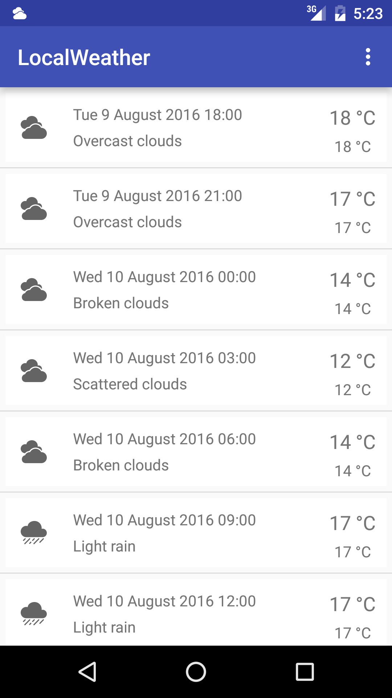
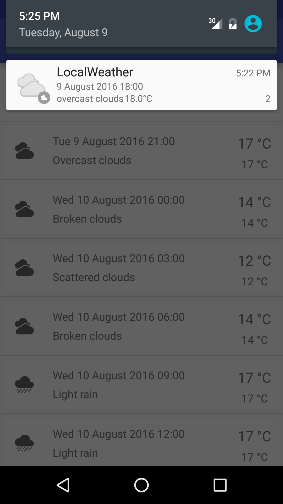
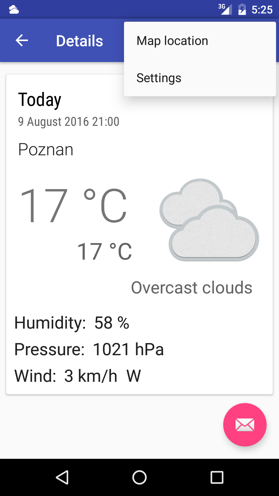
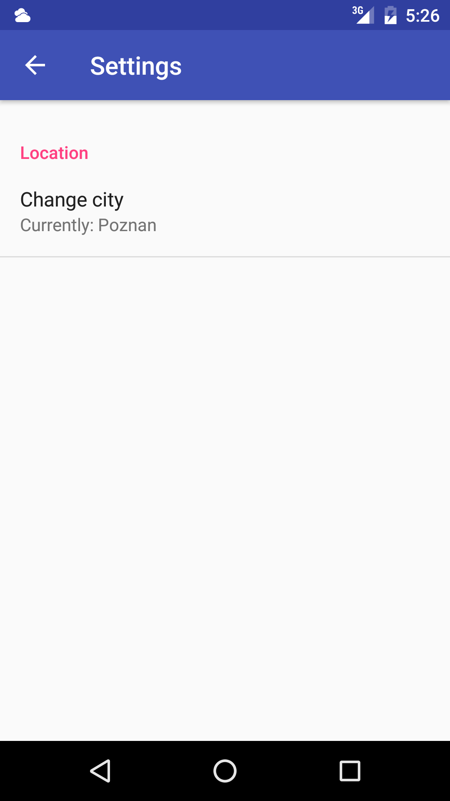

# LocalWeather       

Previously name: WeatherForPoznan

Android application using OpenWeatherMap API that shows current weather conditions.

Screenshots
------

Libraries already used:
-----
- AndroidAnnotations
- ActiveAndroid
- Retrofit
- Gson
- Picasso
- Espresso
- Robolectric
- Crashlytics

TODO:
-----
- [ ] Fix refreshing Notification data
- [ ] Fix saving and loading City
- [x] Add change city Settings option
- [ ] Add turn on/off notifications Settings option
- [ ] Add change temperature units Settings option
- [ ] Try to add autocomplete to EditTextPreference
- [ ] Rewrite existings Android tests

Issues
------

Feel free to submit issues and enhancement requests.

Contributing
------------

Please refer to each project's style guidelines and guidelines for submitting patches and additions. In general, we follow the "fork-and-pull" Git workflow.

 1. **Fork** the repo on GitHub
 2. **Clone** the project to your own machine
 3. **Commit** changes to your own branch
 4. **Push** your work back up to your fork
 5. Submit a **Pull request** so that we can review your changes

License
-------

    Copyright 2016 Piotr Ekert

    Licensed under the Apache License, Version 2.0 (the "License");
    you may not use this file except in compliance with the License.
    You may obtain a copy of the License at

       http://www.apache.org/licenses/LICENSE-2.0

    Unless required by applicable law or agreed to in writing, software
    distributed under the License is distributed on an "AS IS" BASIS,
    WITHOUT WARRANTIES OR CONDITIONS OF ANY KIND, either express or implied.
    See the License for the specific language governing permissions and
    limitations under the License.

