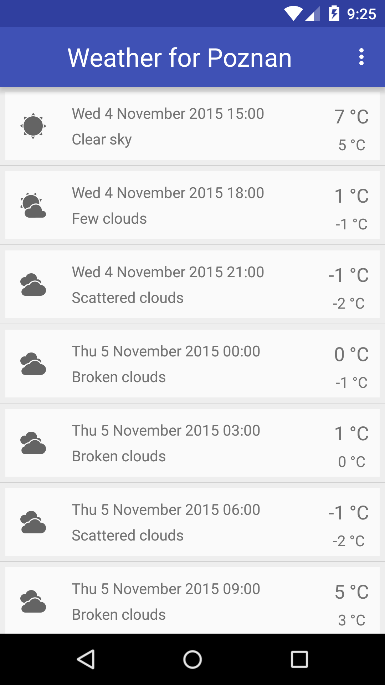
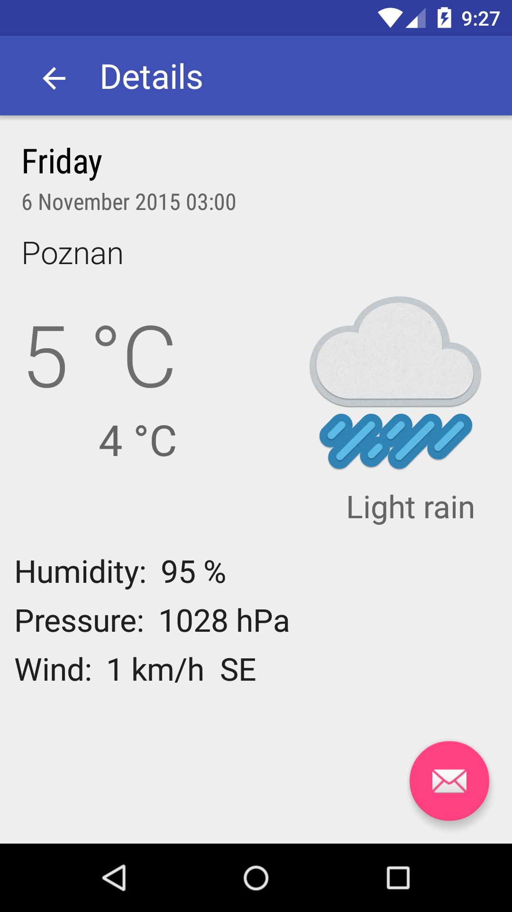

# WeatherforPoznan [](https://travis-ci.org/piotrek1543/WeatherforPoznan) [](http://www.apache.org/licenses/LICENSE-2.0.html)


##About
Practice weather app. Uses OpenWeatherMap API, retrofit, gson, AndroidAnnotations and ActiveAndroid. 

##Screenshots



## Build Instructions
 
- Clone the project from GitHub: 
   ```
   git clone piotrek1543/WeatherforPoznan.git
   ```
   or download the .zip [here](https://github.com/piotrek1543/WeatherforPoznan/archive/master.zip).

- Import the project in Android Studio: **File > New > Import Project**.
  Alternatively, from the Welcome screen, select **Import project**.

##Contributing
Please, feel free to report any issue or make a pull request.

###### This app is still under development. Be patient!
